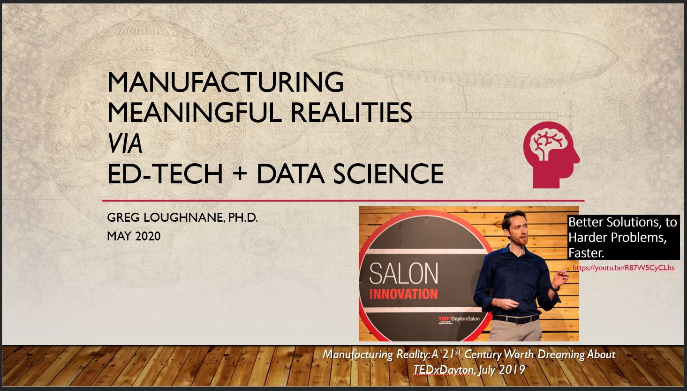

# Data Incubator Fellowship Capstone Project Pitch
Check out my 3-Minute Video Description on YouTube!! 

:point_up: :point_up: :point_up:

## Introduction
Education is changing rapidly all around the world and have never had the magnifying glass on it quite like in the midst of the COVID-19 pandemic.  This Fall, for example, what will students, parents, faculty, and university administration demand of their employees and customers?  Will classes be held on site or remote?  This is a great opportunity for Massive Open Online Courses (MOOCs) to reach a broader audience.  For this to happen, though, we need the right tools to allow the average American to take a good hard look at these alternative forms of education. 

My project will serve as the seed to a grander medium to long term vision to change how we think about education.  While I will begin by looking directly at university-level education and post-graduation job searching via Coursera and LinkedIn, as a start, the same approach could potentially be applied to the K-12 level (e.g., to help places like [Acton Academy](https://www.actonacademy.org/), the tech-school/community college level (e.g., to help initiatives like the [New Collar Workforce Network](https://newcollarnetwork.com/), not to mention to many other MOOC platforms and bootcamp programs (like the [Data Incubator](www.thedataincubator.com)!). 

The idea is this: create a google for MOOCs + career alignment; think “moocle,” but with a personalized twist that sites like [MOOC List](https://www.mooc-list.com/) do not have.  Parents, students, educators, and employers alike need a place where they can go to figure out the best path forward that allows them to aim, but also to modify what's in their sights as they go along. 

## Research Question
The research question that I want to answer is:  

> Is there a clear path of least resistance and lowest cost/highest effectiveness (cost and effectiveness metrics TBD) that will allow for a customized academic program of study, *aimed at a specific job title and locale*, capable of adapting to the rapidly expanding and changing job and  ed-tech marketplaces and, that leverages remote learning, and can be used by students, parents, educators, and employers alike to choose a locale, an industry, and a job title?

Imagine if we could create custom process flow diagrams like [this one](https://mechanical.mines.edu/wp-content/uploads/sites/98/2019/07/BSME-Flowchart-2018-19.pdf), which is for a BSME @ the Colorado School of Mines.

Even better, imagine if every young boy and girl could spend their time in school building up the data that would generate a personalized interactive graph network with many possible paths that could be chosen which ultimately led to where they wanted to be.  Visualize this possibility as being similar to the D3.js network shown [here](https://youtu.be/Mae3uR9HSjQ) from a former Data Incubator alum, Eric Hoppmann, from a not entirely unrelated project interested in tracking academic publications.

### Example: What does it mean to be a Mechanical Engineer?
Consider, as an example, the mechanical engineer of today.  He might need to know much more than a classic mechanical engineering degree will teach him; this of course, depends on the type of job that he hopes to get.   

A [mechanical engineer at Apple](https://www.linkedin.com/jobs/search/?currentJobId=1843228084&geoId=106758460&keywords=display%20mechanical%20engineer&location=Cupertino%2C%20California%2C%20United%20States), for example, needs to have not only classical ME skills like CAD and tolerancing, but also needs a deep understanding of product development across multiple CAD platforms, multi-physics simulation, product and experimental design, and optimization.  The successful candidate will also be able to demonstrate a systems-level understanding of, as in this example, an LCD module for MAC displays.  For this he or she must also be well-versed in certain aspects of electrical engineering, computer engineering, and computer science that are important for consumer electronics design.  These skills constitute a knowledge base that every university in the world is completely unprepared to provide a student with.  These are the jobs of tomorrow.  

That being said, a mechanical engineer down the street at your local machine shop might not need nearly the level of expertise in areas related to electronics, computer engineering and computer science, but might need to be well-versed in operations methodologies from a business perspective, and in emerging technology areas that might affect his job; for example, like 3D printing or robotic automation.  This is only true, of course, if he wants to help his machine shop stay competitive and in business, and to protect his own livelihood in the medium to long term. 

There very few university-level programs (if any) that guide a student through the process of learning the necessary skills to be able to complete either one of these jobs.  Historically, we've always relied on the actual businesses to fill in the gaps in understanding for all students via direct experience.  

As the world becomes more complex, connected, and remote, we must create better tools to help students who don’t have access to prestigious universities in high-tech urban areas that also offer multi-faceted internship and co-op programs to be able to compete.  This will push everyone forward.  To accomplish this, We must try to synthesize what a young person *really* needs so that they can aim single-mindedly at a minimally-sufficient amount of complexity; at least to start contributing, get a foot in the door, and begin to deliver value to themselves, their family, their community, and their employer.  

It is also imperative that thse types of recommender-system educational programs are connected to constantly-changing data sources that are representative of our emerging market realities, which sometimes can be subjected to massive, global-scale economic shifts (i.e., COVID-19).

## OK Great - So How Exactly Will I Do This?
My project while in the incubator will focus on a good first step to solving this problem, using two primary data sources:

1) Coursera course data
2) LinkedIn job and industry data

First, I will scrape Coursera and LinkedIn for relevant course and job information in two areas that I'm intimately familiar with: advanced manufacturing and data science. Each of these meta-categories have many different subcategories (on both the jobs and education side, and they don't align particularly well) which are beyond the scope of this short pitch.

Check out some very preliminary notebooks that I've put together below:

1) [Coursera Scraping Notebook](https://github.com/gregloughnane/DataIncubatorFellowship/blob/master/Coursera_Scrape_Loughnane.ipynb) *Note that there are additional ideas on where to take this at the bottom of this ipynb*

2) [LinkedIn Profile data analysis](https://github.com/gregloughnane/DataIncubatorFellowship/blob/master/LinkedIn_Data_Analysis_Loughnane.ipynb) of the [LinkedIn Profiles Data Set](https://blog.thedataincubator.com/tag/data-sources/) provided by the Data Incubator and Thinkum.  *On the LinkedIn side, I will need to dig deeper into additional industries, locales, and job titles for additional richness*.  This is just to show that I will get it done.

### Locales-of-Interest
In order to make this project most relevant to me and my region, I will investigate jobs, locales, and companies where I've historically found myself and may potentially find myself.  I will analyze data from particular cities, including Raleigh, NC where I currently reside, as well as Austin, TX, which is a potential future home base, in addition to Dayton, OH, my former hometown of 15 years.  If I find myself taking part in one of the in-person programs, I will include the city in which I'm residing as well. 

### Industries and Job Titles
Further, to make sure that I'm making this as relevant to my own life and the lives of those in my network as possible - so as to create maximum impact - I will focus on two broad categories of jobs; advanced manufacturing (especially 3D printing/ additive manufacturing), and data science (especially data scientist) roles.  

###  Final thoughts on Moving from Research & Development to Engineering (and, longer term, Production and Refinement??)
I hope to ideate with Data Incubator instructors and fellowship cohort members to further develop and refine how exactly to break this down into measurable job titles across specific industries and regions of the US, but I'm certain that I can let the data guide my development and hyptotheses as I create my proof-of-concept in an appropriately bounded design space.  I will be sure to explicity state my assumptions at each step, so as to be able to come back to the narrowing points in the future if I ever to work on, build, manage, or oversee a similar and more expansive tool. 

#### Phase I: R&D (~Weeks 1-4)
I'd really like to do not only the R&D to get me to command line functionality, but to also do the D to move to Minimum Viable Product status.  

#### Phase II: Product Demo Interactive Tool Dev (~Weeks 2-6)
From there, I'd like to continue the D and put a shiny, sleek, interactive front end on it via D3.js (as discussed above).

#### Phase III: Engineering and ML Ops (~Weeks 5-8)
Once I have this, my focus will turn to the engineering and MLOps side of the equation.  I will use Allegro.ai's [open source TRAINS-server platform](https://github.com/allegroai/trains-server) to manage my machine learning and deep learning algorithms and results, so as to be able to track improvements and to manage my models as well as possible while my data is still relatively static.

#### Phase IV: Refinement (see Phase I-III) and Production Investigations (i.e., connection to live data)
Time permitting, I will try to investigate the ease of and utility in connecting the plumbing provided by Allegro.ai's TRAINS-server platform to live data sources so that my model can update daily as LinkedIn changes.  This is where my data and software engineering skills will really be put to the test.

-----------------------------------------------------------------------------------------------------------------------------
As someone who has been adjunct teaching engineering courses at universities since 2011, and who has, as a result intimately kept tabs on the state of education in the last decade, my hope is that this project can be one step in the right direction towards fixing something that we all agree is broken.

Signing off here with some words from a very wise man...

> “The real University, he said, has no specific location. It owns no property, pays no salaries and receives no material dues. The real University is a state of mind. It is that great heritage of rational thought that has been brought down to us through the centuries and which does not exist at any specific location. It's a state of mind which is regenerated throughout the centuries by a body of people who traditionally carry the title of professor, but even that title is not part of the real University. The real University is nothing less than the continuing body of reason itself.”

― Robert Pirsig, Zen and the Art of Motorcycle Maintainance
